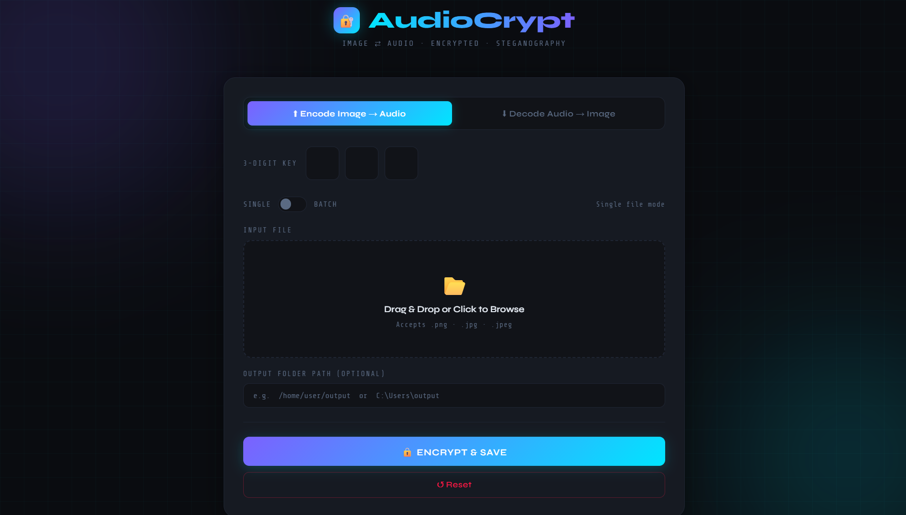
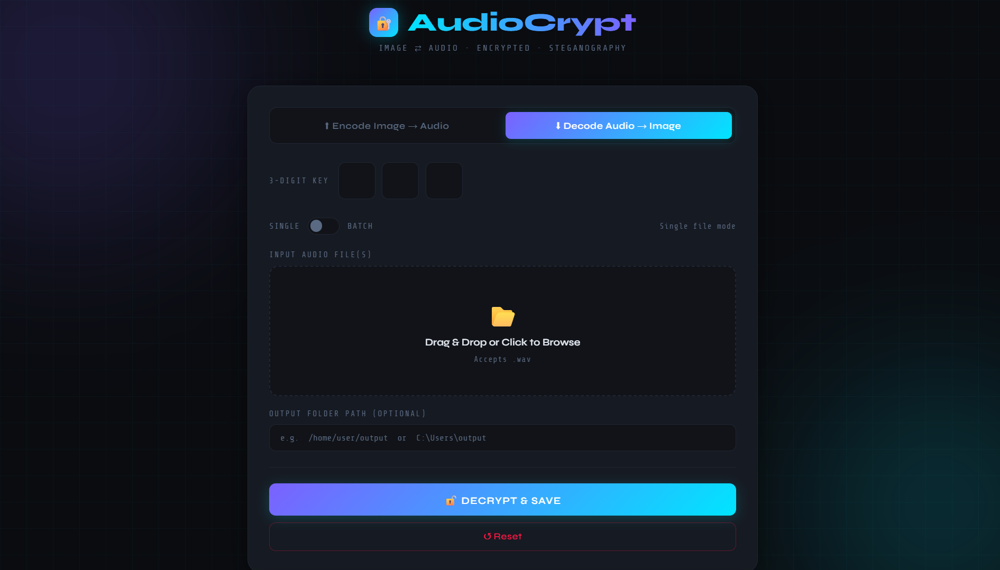
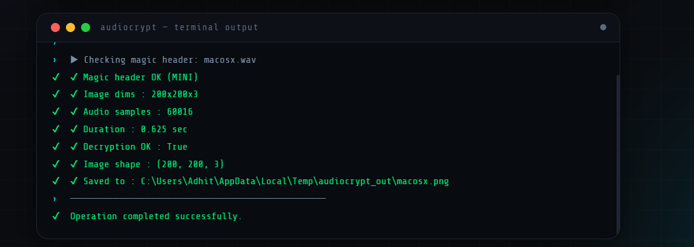

# 🔐 AudioCrypt

AudioCrypt is a cross-platform cryptography and steganography tool that securely converts image data into encrypted WAV audio files and reconstructs the original image from the encrypted audio.

The project combines image processing, audio processing, SHA-256 based key derivation, and symmetric encryption to provide a lightweight method for secure image transport and storage.

---

## ✨ Features

* 🔒 Image → Encrypted Audio conversion
* 🔓 Audio → Image reconstruction
* 🔑 SHA-256 based key derivation
* 🛡 XOR-based symmetric encryption
* 🎯 3-digit secret key authentication
* 📦 Batch file processing
* 🌐 Flask Web Interface
* 💻 Command Line Interface (CLI)
* ✅ Magic Header validation for integrity checking
* 🖼 PNG, JPG, JPEG image support
* 🎵 WAV audio generation
* ⚡ Cross-platform support (Windows, Linux, macOS)

---

## 📂 Project Structure

```text
AudioCrypt/
│
├── core/
│   ├── app.py
│   ├── cli.py
│   │
│   ├── conv/
│   │   ├── __init__.py
│   │   ├── crypt.py
│   │   └── imgaudpro.py
│   │
│   └── templates/
│       └── index.html
│
├── samples/
├── Dox/
├── requirements.txt
└── .gitignore
```

---

## ⚙️ Requirements

- Python 3.10 or higher
- Flask
- NumPy
- SciPy
- Pillow

---

## 📥 Installation

### Windows

```powershell
git clone https://github.com/Ra-Helios/AudioCrypt.git

cd AudioCrypt

python -m venv .env

.env\Scripts\activate

pip install -r requirements.txt
```

### Linux

```bash
git clone https://github.com/Ra-Helios/AudioCrypt.git

cd AudioCrypt

python3 -m venv .env

source .env/bin/activate

pip install -r requirements.txt
```

### macOS

```bash
git clone https://github.com/Ra-Helios/AudioCrypt.git

cd AudioCrypt

python3 -m venv .env

source .env/bin/activate

pip install -r requirements.txt
```

---

## 🚀 Running the Web Application

```bash
cd core

python app.py
```

Flask will start locally on:

```text
http://127.0.0.1:5000
```

---

## 💻 Running the CLI Version

```bash
cd core

python cli.py
```

---

## 🔐 Encoding Workflow

1. Select an image file (`.png`, `.jpg`, `.jpeg`)
2. Enter a 3-digit secret key
3. Image pixels are flattened into raw byte data
4. Metadata and validation headers are added
5. Data is encrypted using a SHA-256 derived key
6. Encrypted bytes are stored as WAV audio samples
7. Audio file is generated and saved

---

## 🔓 Decoding Workflow

1. Select an encoded WAV file
2. Enter the correct 3-digit secret key
3. Audio payload is decrypted
4. Magic header is validated
5. Image metadata is recovered
6. Original image is reconstructed
7. Image is saved as PNG

---

## 🏗 Architecture

```text
IMAGE
  │
  ▼
Flatten Pixels
  │
  ▼
Header + Metadata
  │
  ▼
SHA-256 Key Derivation
  │
  ▼
Encryption
  │
  ▼
WAV Audio Output

────────────────────────

WAV Audio Input
  │
  ▼
Decryption
  │
  ▼
Header Validation
  │
  ▼
Image Reconstruction
  │
  ▼
Recovered Image
```

---

## 🔑 Cryptographic Design

AudioCrypt uses a custom symmetric encryption scheme.

### Key Generation

- User enters a 3-digit numeric key
- The key is repeatedly hashed using SHA-256
- 100 rounds of hashing are performed
- The resulting digest is used as the encryption key

### Encryption

- Payload bytes are XORed with the generated key stream
- The same operation is used during decryption

### Validation

A custom magic header is embedded in every encrypted payload:

```text
MINI
```

During decoding, this header is verified before reconstruction begins.

---

## 📦 Supported Formats

### Input

| Mode | Supported Files |
|------|----------------|
| Encode | PNG, JPG, JPEG |
| Decode | WAV |

### Output

| Mode | Output |
|------|--------|
| Encode | WAV |
| Decode | PNG |

---

## 📸 Screenshots
Screenshots for reference

### Encoding



### Decoding



### Mini Terminal




---

## 🧪 Example Usage

### Encode

```text
Input:
image.png
Key: 123

Output:
image.wav
```

### Decode

```text
Input:
image.wav
Key: 123

Output:
image.png
```

---

## 🎓 Educational Purpose

This project was developed as an educational cryptography and multimedia security project demonstrating:

- Symmetric encryption
- Key derivation
- Audio processing
- Image processing
- Data serialization
- Steganographic concepts
- Flask web development

---

## 🔮 Future Improvements

- AES-256 encryption
- Video steganography
- QR-code integration
- Metadata protection
- Secure file signatures
